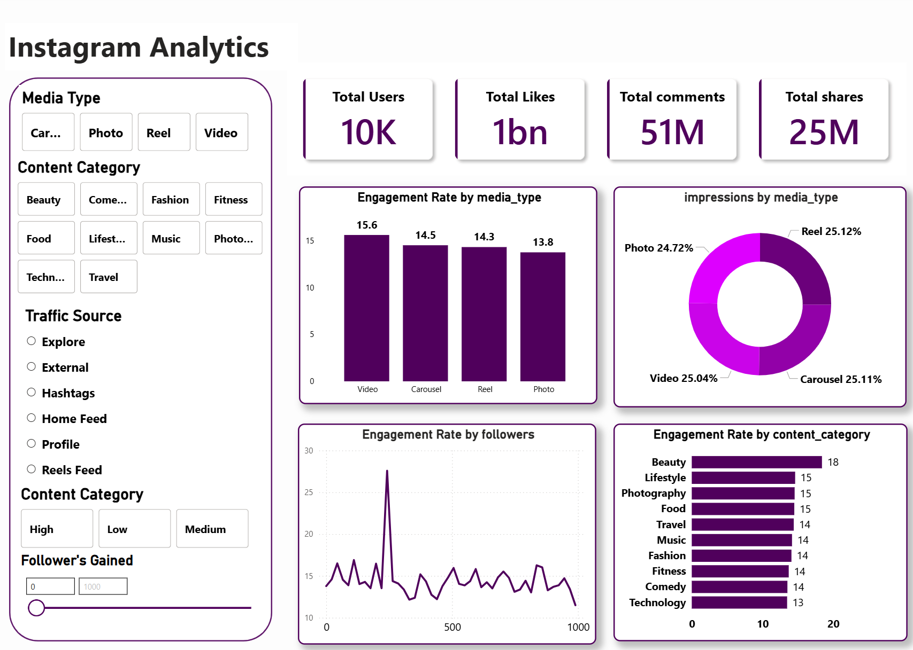

Instagram Analytics Dashboard

1. Project Overview
   This project analyzes Instagram performance data to understand engagement,
   reach, and content effectiveness. It demonstrates a complete data analytics
   workflow from raw data cleaning to interactive dashboard creation.

2. Objective of the Project
   - Clean and preprocess raw Instagram data
   - Analyze engagement and performance metrics
   - Use SQL for structured data analysis
   - Build an interactive Power BI dashboard
   - Generate insights to support content strategy decisions

3. Tools and Technologies Used
   - Python (Pandas, NumPy) for data cleaning and analysis
   - Jupyter Notebook for exploratory data analysis
   - SQL for querying and structured insights
   - Power BI for interactive data visualization
   - CSV files for data storage

4. Project Structure
   - instagram.csv: Raw Instagram dataset
   - instagram_cleaned.csv: Cleaned dataset after preprocessing
   - instagram_cleaning.ipynb: Python notebook for data cleaning
   - Instagram.sql: SQL queries used for analysis
   - Instagram_Analysis.pbix: Power BI dashboard file
   - README.md: Project documentation

5. Data Cleaning Process
   - Removed missing and inconsistent values
   - Standardized column formats
   - Prepared clean data for analysis and visualization
   - Exported cleaned data for SQL and Power BI usage

6. Analysis Performed
   - Studied engagement patterns across posts
   - Compared performance of different content types
   - Identified high-performing posts
   - Analyzed reach and interaction metrics

7. Power BI Dashboard Features
   - Interactive visualizations
   - Clear layout for easy understanding
   - Filters for exploring performance data
   - Business-friendly presentation of insights

8. Key Insights
   - Engagement differs based on content type
   - Certain posts generate higher interaction
   - Data-driven analysis improves posting strategies
   - Visualization simplifies complex data

9. How to Use This Project
   - Open instagram_cleaning.ipynb to view data cleaning steps
   - Review Instagram.sql for SQL-based analysis
   - Open Instagram_Analysis.pbix in Power BI Desktop
   - Explore insights using dashboard filters

10. Skills Demonstrated
    - Data Cleaning and Preprocessing
    - Exploratory Data Analysis (EDA)
    - SQL Query Writing
    - Data Visualization using Power BI
    - Analytical and Problem-Solving Skills

11. Author
    - Dev Rijwani
    - Data Management & Visual Insights
    - Data Analytics | Data Science | Generative AI

12. Final Note
    - This project is created for learning, portfolio, and internship evaluation
    - purposes. Feedback and suggestions are welcome.

📊 Dashboard Preview

